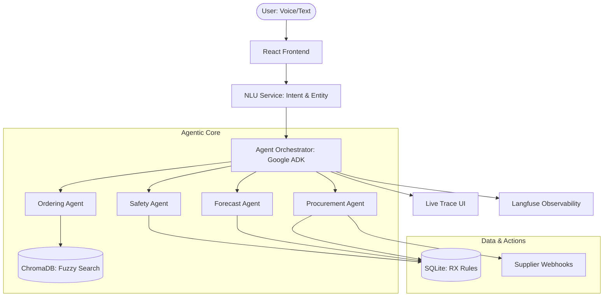
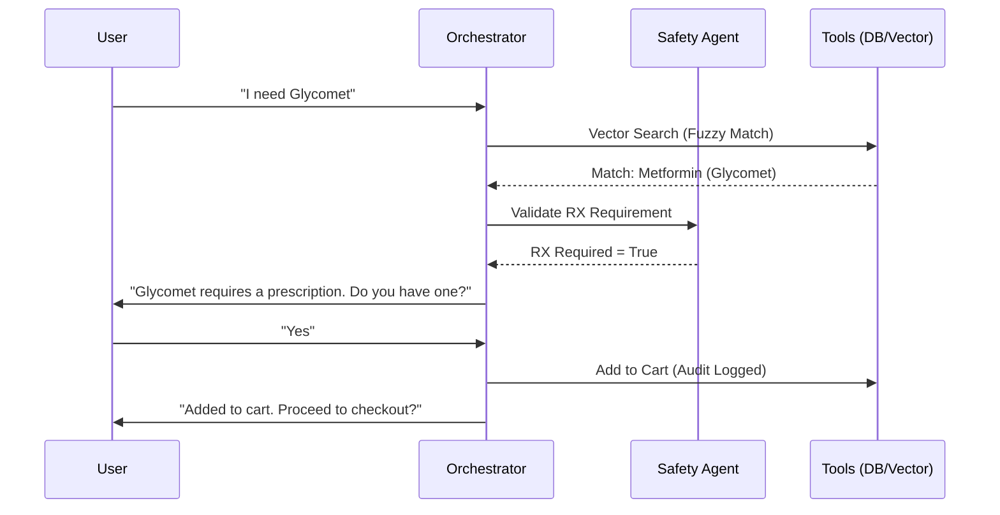
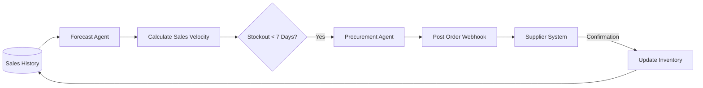

# Mediloon PPT: Structured Content

## 1. Problem Statement
The Indian pharmaceutical retail landscape faces critical inefficiencies that compromise patient safety and supply chain reliability.

*   **Complexity of Ordering:** Patients struggle with complex brand names, leading to frequent misspellings and incorrect self-medication requests.
*   **Regulatory & Safety Gaps:** Lack of automated, reliable checks for prescription-only (RX) drugs and dangerous cross-class substitutions at the point of order.
*   **Reactive Supply Chain:** Pharmacies often run out of essential chronic medications because they rely on manual inventory tracking rather than predictive demand.
*   **Lack of Transparency:** Traditional automated systems are "black boxes," making it difficult for pharmacists or regulators to trust the reasoning behind automated decisions.

## 2. Proposed Solution: Mediloon Agentic Pharmacy
An autonomous, voice-first agentic system that transforms pharmacy operations from reactive to proactive.

*   **Multi-Agent Intelligence:** A specialized team of agents (Ordering, Safety, Procurement, Forecast) working in sync to handle the entire lifecycle of a medication request.
*   **Natural Voice-First UX:** Seamless Speech-to-Text (STT) and Text-to-Speech (TTS) integration, making health access as simple as a conversation.
*   **Agentic Fulfillment:** Not just a chatbot—it's a system that takes action. It auto-generates procurement orders and sends real-time webhooks to suppliers when stock is predicted to run low.
*   **"Safety-First" Architecture:** Built-in India-specific compliance guardrails that enforce prescription verification and prohibit unsafe drug substitutions.
*   **Observability & Trust:** A real-time "Trace Panel" that exposes the agent’s Step-by-Step reasoning (Plan → Act → Observe), ensuring clinical accountability.

## 3. System Architecture
A modular, agentic monorepo tailored for low latency and high reliability.

### **Core Layers**
*   **User Interface (The Interaction):** 
    *   React/Vite with Tailwind CSS for a premium, fast UI.
    *   Web Speech API for native browser STT/TTS.
*   **Agent Orchestration (The Brain):**
    *   **Google ADK Orchestrator:** Manages the conversation state and task planning.
    *   **NLU Service:** Multi-model parsing (Mistral/Qwen via OpenRouter) to extract intent and entities.
    *   **Planner:** High-reasoning LLMs to decide between tool calls, safety checks, or user clarification.
*   **Data & Memory (The Knowledge):**
    *   **SQLite:** Reliable relational storage for catalog, inventory, and audit trails.
    *   **ChromaDB:** Vector database for fuzzy brand matching and semantic retrieval.
*   **Service Layer (The Action):**
    *   **Procurement Webhooks:** Automated HTTP POST requests to supplier APIs for stock replenishment.
    *   **Forecast Engine:** Sales velocity analysis and predictive stock-out calculations.
    *   **OCR Service:** Machine vision to parse and verify uploaded prescriptions.
*   **Observability (The Insight):**
    *   **Langfuse:** Full L4 tracing of all LLM inputs, outputs, and latencies.
    *   **Trace Panel:** Live frontend component showing real-time backend agent reasoning.

## 4. Unique Selling Propositions (USPs)
*   **Autonomous Closed-Loop Ecosystem:** First system to link customer voice intent directly to backend supply-chain actions (webhooks) without human intervention.
*   **Safety-First Agentic Governance:** Dual-layer safety (NLU validation + Ingredient-level rules) tuned for the Indian regulatory context.
*   **Predictive "Infinite Inventory":** Moves beyond counting to "Demand Forecasting," triggering procurement *before* a stock-out occurs.
*   **Radical Transparency:** Unlike "Black Box" AI, Mediloon exposes its entire reasoning chain in real-time via the Trace Panel.
*   **Proactive Care:** Uses purchase history and sales velocity to perform proactive health checks and refill suggestions.

## 5. Visual Architectures & Flows

## 5. Visual Architectures & Flows

### **High-Level System Architecture**

---

### **The Agentic Ordering Flow (Plan-Act-Observe)**

---

### **The Autonomous Procurement Loop**

---

## Appendix: Technical Source Diagrams (Mermaid)

Click to view Mermaid source code

### System Architecture

### Ordering Flow

### Procurement Loop

